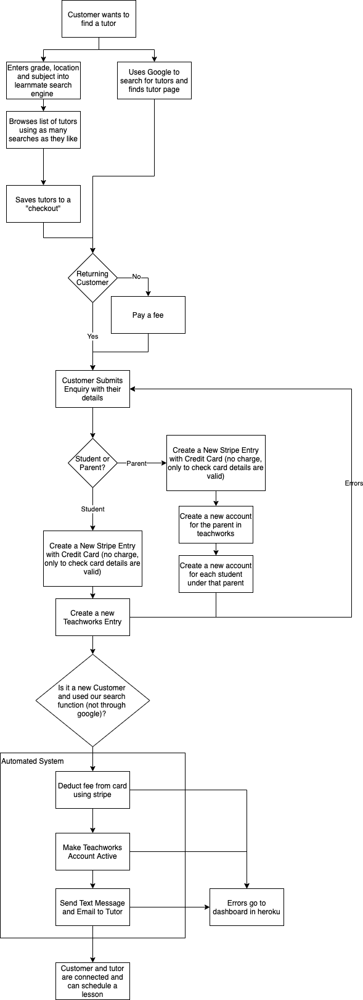

# Learnmate Map API & CMS

Welcome to the Readme for Learnmate Tutoring's map application.

All code and documentation is the property of Learnmate Tutoring Pty Ltd., and cannot be reproduced without the permission of the site owner.

## This Codebase Contains

- The complete Ruby on Rails application.
- The React/Redux front-end for the CMS.
- Documentation for most of the Ruby classes and methods.
- Documentation for most Javascript functions and classes.
- Links to helpful guides to help you get started with development.
- The WordPress PHP plugin that links the search API to the main site.

## This Codebase Does Not Contain
- Any secret/API keys (see heroku env variables)

# Overview

The systems at learnmate have been designed with separation of concerns in mind. Here is a layout of the different systems and their purpose:

# Main Systems

The Main Systems can be summarised as follows:

## LearnMate Map API Wordpress Plugin

- Is a wordpress plugin which is custom made in PHP
- The parts of the website which it handles are:
    - The search box on the front page (https://learnmate.com.au)
    - The in-person and online search results page (https://learnmate.com.au/search-results/)
    - The tutor selection and saving (https://learnmate.com.au/search-results/)
    - The parent and student forms (https://learnmate.com.au/enquire-form/)
    - Tutor search details page for tutors to update details (https://learnmate.com.au/update/update-profile/)
- It interacts directly with the APIs on the Ruby on Rails Platform

## External Heroku Functions

The Heroku System Exposes APIs (as discussed in the last dot point) for the following:
- The search box/function and all functions located within this such as suburb, subject, selection for in-person/online etc
- The list of tutors on the search results page
- The list of tutors on the online search results page with randomisation
- Showing tutor details upon selection of tutor on update profile
- Enquire form submissions

## Internal Heroku Functions

- List of tutors sent from the enquire form is processed
- Credit Card processing on ruby on rails server using Stripe
- Calling the TeachWorks API to register the new student
- Creating new tutors (+ adding their AVATAR, description, addresses, site link etc.)
- Export button works to export all active tutors and their phone numbers
- Adding and Removing subjects
- Changing Username and Password for Heroku Portal.
- An automation in selenium to mark student as active, add relevant tutors and send initial SMS.

## TeachWorks API connecting to/performing the function:

- Sending saved tutors to TW to create a TW account. 
- Sending an automatic SMS through BurstSMS to the tutor for new enquiries.
- How the returning student/family TW accounts are created (and then ignored)
- How the unavailability function works on Heroku and the TeachWorks API (pulling new queries every 24 hours etc)
- How the API pulls updated contact data and inputs this into Heroku daily for the relevant tutors that need to be pulled.

## Other Functions

- How the CDN works through AWS and how it connects to WP Total Cache Plugin.
- The staging site location and how to use/access it.
- The favicon installation and how to use/access it.
- The bespoke nature of the top bar on LearnMate (15 ATAR Success Tips)
- The bespoke nature of the enquire form SCHOOL SUCCESS GUIDE popup that occurs when you try to exit the enquire form page.
- The bespoke nature of AffiliateWP and how student affiliate submissions are processed.

